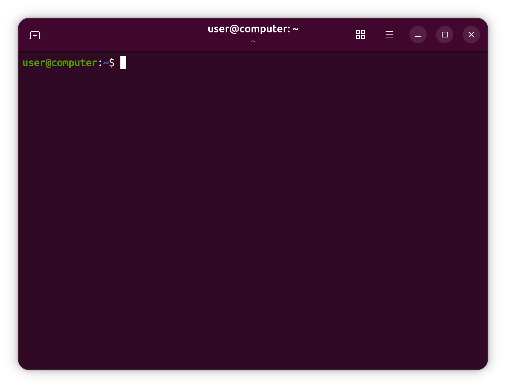

# Ubuntu Server: Installation in der VM

Ubuntu Server wird in dieser Übung über ein ISO-Abbild in der Hyper-V-VM installiert.
Die genaue Installationsoberfläche kann je nach Ubuntu-Version leicht unterschiedlich aussehen.
Wichtig ist, dass am Ende eine startfähige VM entsteht, in der du dich mit deinem Benutzer anmelden kannst.

## ISO-Abbild

Ein Installationsmedium ist ein Medium oder eine Datei, von der ein Betriebssystem installiert wird, zum Beispiel eine DVD, ein USB-Stick oder ein ISO-Abbild.
Ein ISO-Abbild ist eine Datei mit der Endung `.iso`, die den Inhalt eines Installationsmediums enthält.
In einer VM kann ein ISO-Abbild wie eine eingelegte DVD eingebunden werden.

Lade das Ubuntu-Server-ISO entweder über die im Kurs angegebene Quelle oder über die offizielle Downloadseite herunter:

<https://ubuntu.com/download/server>

## Installation starten

Das ISO-Abbild wird in Hyper-V als Installationsmedium eingebunden.
Beim ersten Start bootet die VM vom ISO und öffnet die Ubuntu-Server-Installation.

Während der Installation legst du unter anderem fest:

- Sprache und Tastaturlayout
- Netzwerk während der Installation
- Speicher bzw. Installationsziel
- Benutzername und Passwort

Nutze die Vorgaben deiner Lehrkraft, falls einzelne Installationsschritte konkret vorgegeben werden.
Wenn du unsicher bist, ob eine Auswahl Auswirkungen auf den Host oder andere Systeme hat, frage nach, bevor du fortfährst.

## Benutzer anlegen

Lege während der Installation den Benutzer an, mit dem du später in den Übungen arbeitest.
Notiere den Benutzernamen in der Dokumentationsvorlage.

Wähle ein Passwort, das du sicher erinnern kannst.
Ohne diesen Benutzer kannst du dich nach der Installation nicht sinnvoll in der VM anmelden.

## Nach der Installation

Nach der Installation startet die VM vom virtuellen Datenträger.
Das ISO wird dann nicht mehr als Installationsmedium benötigt.

Falls die VM nach dem Neustart erneut die Installation öffnet, entferne das ISO-Abbild aus den VM-Einstellungen oder passe die Boot-Einstellungen an.

Melde dich anschließend mit deinem Benutzer an.
Nach dem Login solltest du eine Zeile sehen, in der dein Benutzername, der Name der VM und ein blinkender Cursor erscheinen:



Diese Eingabezeile heißt **Shell-Eingabeaufforderung** oder **Shell-Prompt**.
Sie zeigt dir an, dass die Shell bereit ist, deine Befehle entgegenzunehmen.

## Erster Netzwerk- und Paketcheck

Prüfe nach dem ersten Login, ob die VM Paketinformationen aus dem Internet abrufen kann:

```bash
sudo apt update
```

Installiere anschließend `tree` und `unzip`.
`tree` wird in der nächsten Übung verwendet.
`unzip` brauchst du später, um das ZIP-Paket mit den Kursunterlagen in der VM zu entpacken.

```bash
sudo apt install tree unzip
```

Du musst diese Befehle hier noch nicht verstehen.
Die Paketverwaltung mit `apt` wird später genauer besprochen.
Hier geht es nur darum, die VM für die ersten Übungen vorzubereiten und gleichzeitig die Netzwerkverbindung kurz zu testen.
