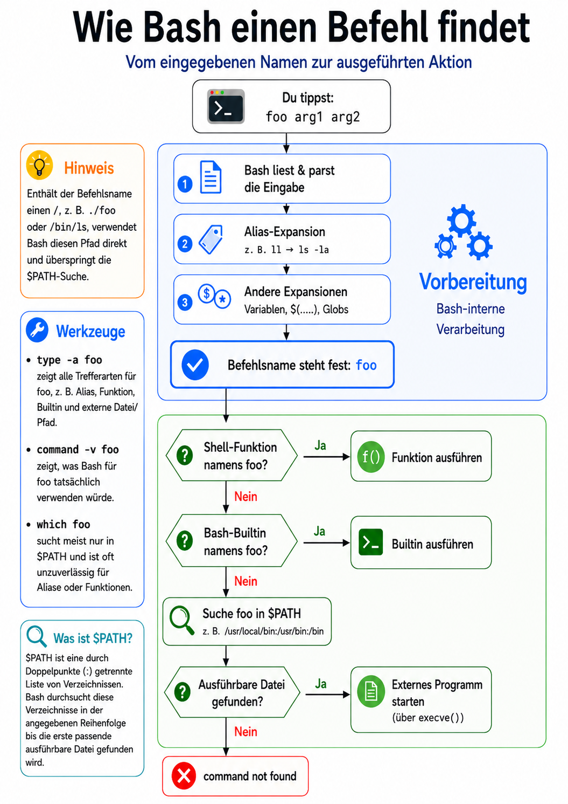

# Kurzreferenz: Shell-Umgebung und Konfiguration

Wenn du Befehle im Terminal eingibst, arbeitest du mit einer Shell.
Die Shell interpretiert deine Eingaben, findet Programme, verwaltet Variablen und liest Konfigurationsdateien ein.
Wenn du diese Umgebung verstehst, kannst du dein Terminal gezielter anpassen und besser nachvollziehen, warum Befehle sich so verhalten, wie sie sich verhalten.

## Inhalt

- [Befehle](#befehle)
- [Wichtige Variablen](#wichtige-variablen)
- [Wichtige Konfigurationsdateien mit Bezug zur Shell](#wichtige-konfigurationsdateien-mit-bezug-zur-shell)
- [Terminal, Shell und Programme](#terminal-shell-und-programme)
- [Befehlsauflösung in der Shell](#befehlsauflösung-in-der-shell)
- [Variablen und Umgebung](#variablen-und-umgebung)
- [Konfiguration dauerhaft machen](#konfiguration-dauerhaft-machen)

## Befehle

### Umgebung und Variablen

| Befehl | Beschreibung | Beispiel |
| ------ | ------------ | -------- |
| `printenv` | Zeigt Umgebungsvariablen an. | `printenv PATH` |
| `env` | Zeigt die Umgebung an oder startet einen Befehl mit angepasster Umgebung. | `env` |
| `export` | Exportiert eine Variable in die Umgebung. | `export EDITOR=nano` |
| `unset` | Entfernt eine Variable aus der aktuellen Shell und ihrer Umgebung. | `unset TESTVAR` |
| `source` | Liest eine Datei in der aktuellen Shell ein. | `source ~/.bashrc` |

### Shell und Befehlsauflösung

| Befehl | Beschreibung | Beispiel |
| ------ | ------------ | -------- |
| `type` | Zeigt, wie die Shell einen Befehlsnamen auflöst, z. B. Builtin, Alias oder Programm. | `type cd` |
| `which` | Zeigt den Pfad zu einem ausführbaren Programm. | `which ls` |
| `whereis` | Zeigt typische Speicherorte zu einem Befehl. | `whereis bash` |
| `command -v` | Zeigt, wie ein Befehl gefunden wird. | `command -v ls` |
| `alias` | Zeigt Aliases an oder legt einen Alias an. | `alias ll='ls -l'` |
| `unalias` | Entfernt einen Alias. | `unalias ll` |

## Wichtige Variablen

Variablen setzt du mit `NAME=Wert`.
Mit `$NAME` liest du den Wert aus.

| Variable | Bedeutung |
| -------- | --------- |
| `PATH` | Suchpfad für ausführbare Programme |
| `HOME` | Home-Verzeichnis des aktuellen Benutzers |
| `USER` | Name des aktuellen Benutzers |
| `SHELL` | Login-Shell des aktuellen Benutzers |
| `EDITOR` | bevorzugter Texteditor für viele Terminalprogramme |
| `VISUAL` | bevorzugter Editor für interaktivere Bearbeitung |
| `PAGER` | bevorzugter Pager für längere Textausgaben |
| `LANG` | Sprache/Locale des Systems |

## Wichtige Konfigurationsdateien mit Bezug zur Shell

| Datei | Rolle | Typische Inhalte | Form |
| ----- | ----- | --------------- | ---- |
| `~/.bashrc` | benutzerspezifische Bash-Konfiguration für interaktive Shells | Aliases, Prompt, `PAGER`, `EDITOR`, eigene Shell-Anpassungen | Bash-Skript |
| `~/.profile` | benutzerspezifische Konfiguration für Login-Shells | eigener `PATH`, Login-bezogene Umgebung, Start der eigenen Shell-Konfiguration | Shell-Skript |
| `/etc/profile` | systemweite Konfiguration für Login-Shells | Vorgaben für alle Benutzer, systemweiter `PATH`, systemweite Startskripte | Shell-Skript |
| `/etc/environment` | systemweite Umgebungsvariablen | `PATH`, Spracheinstellungen wie `LANG`, systemweite Standardwerte | `NAME=Wert` |
| `/etc/passwd` | enthält unter anderem die Login-Shell eines Benutzers | Benutzername, Home-Verzeichnis, Login-Shell | eigene Syntax |

**Interaktive Shells und Login-Shells**
- Eine **interaktive Shell** ist eine Shell, in der du direkt Befehle eingibst.
    Bisher hast du vor allem in interaktiven Shells gearbeitet.
    Skripte werden dagegen zum Beispiel in nicht-interaktiven Shells ausgeführt.
- Eine **Login-Shell** ist die Shell, die beim Anmelden eines Benutzers gestartet wird, zum Beispiel an einer Konsole oder per SSH.

## Terminal, Shell und Programme

- **Terminal**: Die Oberfläche, über die du mit einer Shell arbeitest.
- **Shell**: Das Programm, das deine Eingaben interpretiert und Befehle ausführt, zum Beispiel `bash`, `dash` oder `zsh`.
- **Shell-Builtin**: Ein Befehl, den die Shell selbst bereitstellt, zum Beispiel `cd`.
- **Externes Programm**: Eine ausführbare Datei im Dateisystem, zum Beispiel `/usr/bin/ls`.
- **Alias**: Eine Abkürzung, die die Shell vor dem Ausführen eines Befehls ersetzt, zum Beispiel `ll` für `ls -l`.

Nicht jeder Name, den du im Terminal eingibst, ist also ein eigenständiges Programm.
Einen Unterschied zwischen Shell-Builtins und externen Programmen hast du schon in Übung 2 kennengelernt:
Externe Programme sind in den manpages dokumentiert. Die Dokumentation zu Shell-Builtins öffnest du mit `help`.
Auch `type` hast du dort schon genutzt, um zu prüfen, wie die Shell einen Namen einordnet.

## Befehlsauflösung in der Shell

Wenn du einen Namen wie `ls` oder `cd` eingibst, muss die Shell entscheiden, was damit gemeint ist.

Die folgende Grafik zeigt diesen Ablauf am Beispiel von Bash:



Für uns sind vor allem die folgenden Punkte interessant:

- Aliases und Shell-Builtins werden von der Shell selbst behandelt. Externe Programme werden als ausführbare Dateien im Dateisystem gestartet.
- Für externe Programme ohne direkten Pfad nutzt die Shell die Variable `PATH`. Sie enthält Verzeichnisse, in denen nach ausführbaren Programmen gesucht wird. Die Verzeichnisse sind durch Doppelpunkte getrennt und werden der Reihe nach durchsucht, bis der erste Treffer gefunden ist.
- Befehle wie `type`, `command -v` oder `which` geben dir einen Einblick, wie die Shell zu ihrer Entscheidung kommt.

## Variablen und Umgebung

### Shell-Variablen

Eine **Variable** speichert einen Wert unter einem Namen.
In der Shell kannst du Variablen setzen und mit `$NAME` auslesen:

```bash
PAGER=less
echo "$PAGER"
```

Zwischen Variablenname, Gleichheitszeichen und Wert stehen beim Setzen einer Shell-Variable keine Leerzeichen.
Eine so gesetzte Variable ist zunächst eine Shell-Variable der aktuellen Shell.
Sie ist also in dieser Shell verfügbar, wird aber nicht automatisch an gestartete Programme weitergegeben.

### Umgebungsvariablen

Die **Umgebung** ist die Menge der Variablen, die eine Shell an Programme weitergibt, die aus ihr gestartet werden.
Das ist wichtig, weil viele Programme ihr Verhalten über Umgebungsvariablen anpassen.
Zum Beispiel nutzen einige Programme die Variable `PAGER`, um zu entscheiden, welcher Pager für längere Ausgaben geöffnet werden soll.
Mit `export` machst du eine bereits gesetzte Shell-Variable zu einer Umgebungsvariable:

```bash
PAGER=less
export PAGER
```

Programme, die danach aus dieser Shell gestartet werden, können `PAGER` lesen.
Bereits laufende Programme werden dadurch nicht nachträglich verändert.

Definition und Export können mit folgender Syntax auch in einer Zeile kombiniert werden:

```bash
export PAGER=less
```

## Konfiguration dauerhaft machen mit Konfigurationsdateien

Definitionen oder Änderungen von Variablen, die du direkt in einer Shell-Sitzung vornimmst, gelten nur für diese eine Sitzung.
Wenn du zum Beispiel `less` dauerhaft, also **persistent**, als Pager festlegen möchtest, musst du diese Einstellung an einer Stelle speichern, die beim Start der passenden Shell-Sitzung gelesen wird.

Um diese Art von persistenter Änderung am System vorzunehmen, werden häufig **Konfigurationsdateien** genutzt.
Konfigurationsdateien sind meistens Textdateien.
Syntax und Inhalt unterscheiden sich aber je nach Datei:
Manche Dateien enthalten einfache `NAME=Wert`-Einträge, andere enthalten Shell-Befehle und können wie Skripte eingelesen werden, andere haben ihre ganz eigenen Syntax-Regeln.

### Beispiele: Default-Pager und Default-Shell

- Da `~/.bashrc` ein Bash-Skript ist, kannst du dort zum Beispiel `export PAGER=less` als eigene Zeile einfügen. Dadurch wird `PAGER` zu Beginn jeder interaktiven Bash-Sitzung gesetzt und `less` somit persistent als Default-Pager festgelegt.
- Die **Default-Shell** eines Benutzers ist ebenfalls eine Konfiguration.
Sie ist in `/etc/passwd` eingetragen und kann mit dem Befehl `chsh` verändert werden.

Wenn du eine Konfigurationsdatei, zum Beispiel `~/.bashrc`, geändert hast, musst du nicht zwingend ein neues Terminal öffnen.
Du kannst die Datei einfach neu einlesen:

```bash
source ~/.bashrc
```
